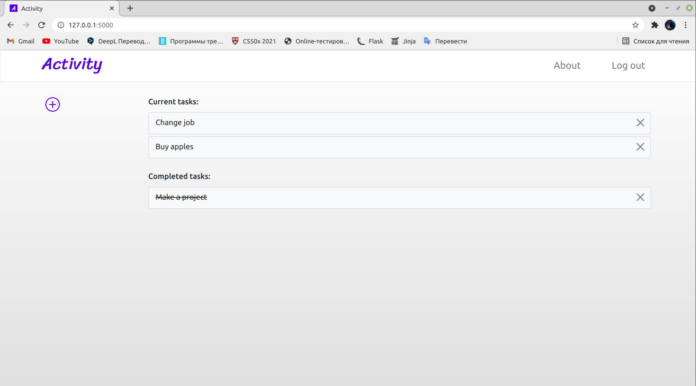

# Activity
#### Description:

Activity is simple and awesome app to organize your tasks with very easy to use interface. Activity can help you to make list of your tasks and focus on completing them.

A personal account is created for the user, in which all tasks added by the user are stored. It is also possible to view previously completed tasks or delete them permanently.

Activity is easy to use thanks to its intuitive design.

This web app is written in Python with [Flask](http://flask.pocoo.org/) Framework.

#### Understanding

**`application.py`**

Atop the file are a bunch of imports, among them CS50’s SQL module and a few helper functions.

After configuring Flask, the file configures CS50’s SQL module to use `project.db`, a SQLite database.

The file uses `db.execute` (from CS50’s library) to query `project.db`. And  it uses `check_password_hash` to compare hashes of users’ passwords. Finally, `login` “remembers” that a user is logged in by storing his or her `user_id`, an INTEGER, in `session`. That way, any of this file’s routes can check which user, if any, is logged in. Meanwhile,  `logout` simply clears `session`, effectively logging a user out.

**`requirements.txt`**

That file simply prescribes the packages on which this app will depend.

**`static/`**

In the `static` directory is a `styles.css` file containing the CSS code for this web application.

**`templates/`**

In login.html is, essentially, just an HTML form, stylized with Bootstrap.
layout.html comes with a “navbar” (navigation bar), also based on Bootstrap.

#### Run

You will need Python and Flask installed on your computer to run this application.

Start by installing Python 3. Here's a guide on the installation. Once you have Python, and clonned this repository, run the following commands:

To install pip, run:

`sudo apt install python3-pip`

To install Flask, run:

`sudo apt install python3-flask`

To install this project's dependecies, run:

`pip3 install -r requirements.txt`

Define the correct file as the default Flask application:

Unix Bash (Linux, Mac, etc.):

`export FLASK_APP=application.py`

Windows CMD:

`set FLASK_APP=application.py`

Windows PowerShell:

`$env:FLASK_APP = "application.py"`

Run Flask and you're good to go!

`flask run`
